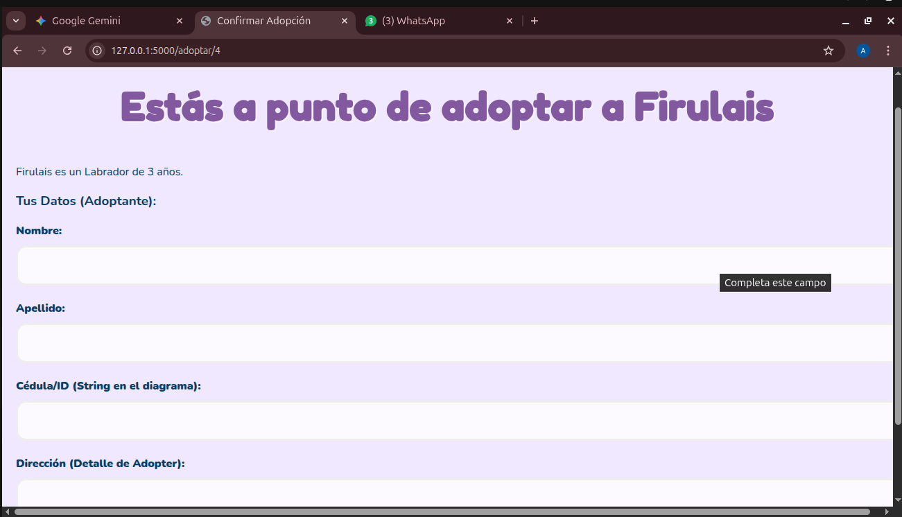

# 🐾 Sistema de Gestión: Centro de Adopción de Perritos

Este proyecto es una plataforma web integral diseñada para digitalizar y facilitar el flujo de adopción de 
mascotas. El sistema permite gestionar desde el registro de nuevos caninos hasta la confirmación final de su 
adopción, utilizando un entorno seguro y visualmente amigable.

## Capturas del Proceso y Funcionamiento

### 1. Catálogo
Vista principal donde el administrador o usuario puede visualizar a los perritos disponibles. Se aprecia el uso 
de las tonalidades lilas y la disposición organizada de los elementos.
> 

### 3. Registro y Formulario de Adopción
El proceso de captura de datos cuenta con validaciones para asegurar que la información de cada perrito (raza, edad, descripción) sea correcta antes de guardarse en el servidor.
> 

### 4. Confirmación de Adopción
Interfaz final que recibe al usuario tras completar un proceso exitoso, manteniendo la coherencia visual del sistema.
> 

## Stack Tecnológico

* **Lenguaje:** Python 3
* **Framework Web:** Flask
* **Base de Datos:** MySQL (Relacional)
* **Frontend:** HTML5, CSS
* **Entorno de Desarrollo:** VS Code en Ubuntu Linux

## Instalación y Configuración Local

1. **Clonar el repositorio:**
   ```bash
   git clone [https://github.com/tu-usuario/centro-adopcion.git](https://github.com/tu-usuario/centro-adopcion.git)
   cd centro-adopcion
