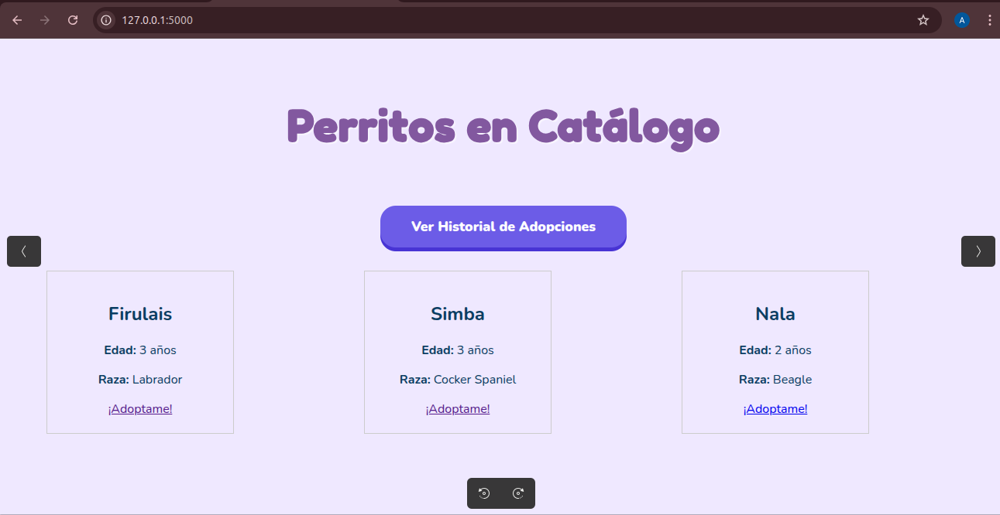
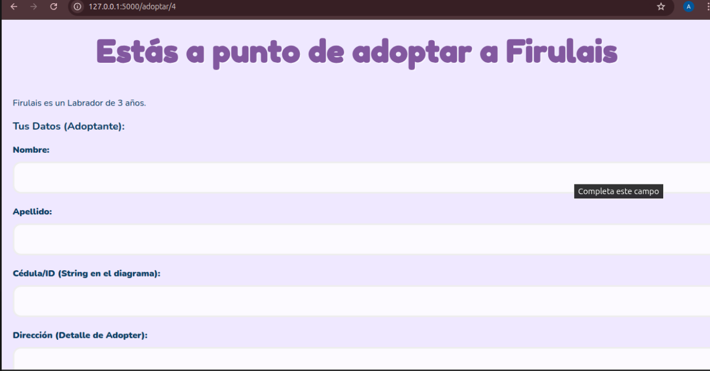
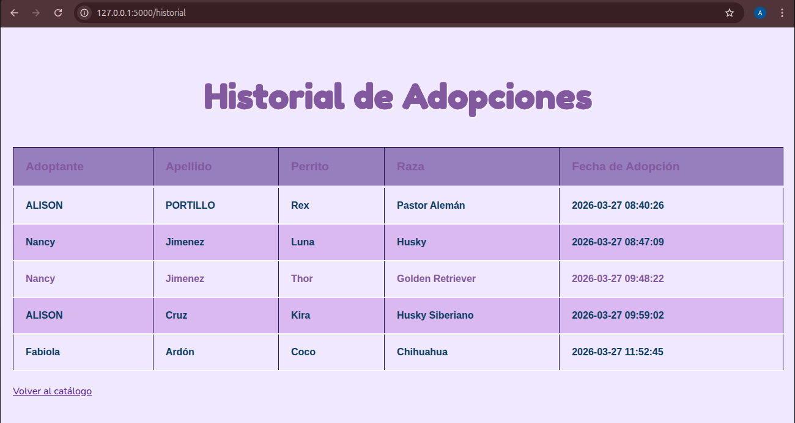

# 🐾 Centro de Adopción de Perritos

Este proyecto es una plataforma web integral diseñada para digitalizar y facilitar el flujo de adopción de 
mascotas. El sistema permite gestionar desde el registro de nuevos caninos hasta la confirmación final de su 
adopción, utilizando un entorno seguro y visualmente amigable.

## Capturas del Proceso y Funcionamiento

### 1. Catálogo
Vista principal donde el administrador o usuario puede visualizar a los perritos disponibles. Se aprecia el uso 
de las tonalidades lilas y la disposición organizada de los elementos.
> 

### 2. Registro y Formulario de Adopción
Esta es la vista del formulario para la agregar el nombre de la persona que quiere adoptar, el lugar a donde vive y el ID luego de a ver completado dichos campos ya se puede realizar la adopción.
> 

### 3. Historial de adopción
Y por ultimo se muestra la vista al historial de adopciones en donde se puede visualizar que perritos fueron adoptados por quien fue adoptado,la hora y la fecha de dicha adopción.
> 

## Stack Tecnológico

* **Lenguaje:** Python 3
* **Framework Web:** Flask
* **Base de Datos:** MySQL (Relacional)
* **Frontend:** HTML5, CSS
* **Entorno de Desarrollo:** VS Code en Ubuntu Linux

## Instalación y Configuración Local

1. **Clonar el repositorio:**
   ```bash
   git clone [https://github.com/tu-usuario/centro-adopcion.git](https://github.com/tu-usuario/centro-adopcion.git)
   cd centro-adopcion
